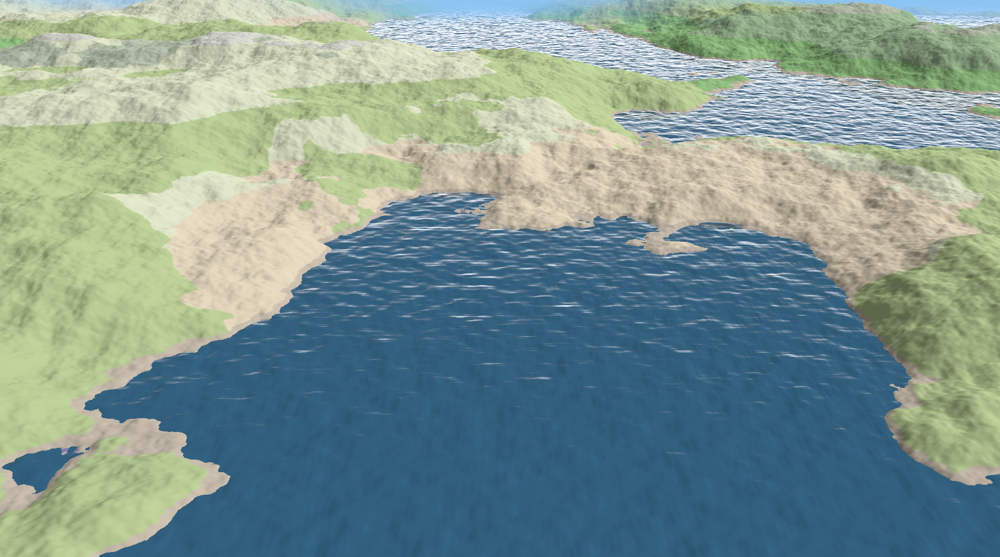
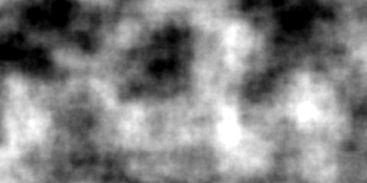
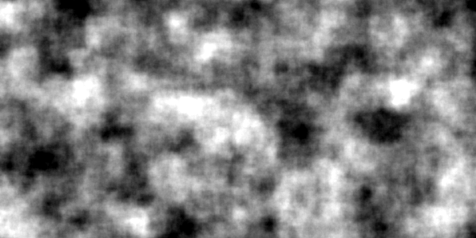
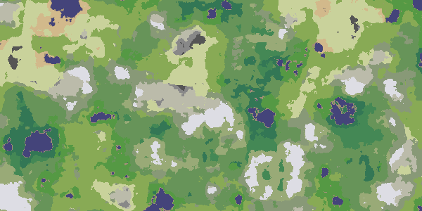

# Random terrain generation and rendering
## Description

This project is a simple Vulkan rendering example of a random generated terrain.


The terrain generation is done on the GPU, using a Vulkan compute pass before the rendering pass.
An example can be found in `main.cpp`.

The generation and rendering is hold byt the `cg::TerrainEngine` class.
It can be configured with the following methods:
 - `setRefDistance()` :  used to compute the terrain hills and water waveLengths, set it to the same
 order of magnitude of your frustum far distance for example, or smaller for a sharper terrain.
 - `setBaseResolution()` : terrain spatial resolution (directly affects the performances)
 - `setFarDistance()` : far distance to be displayed.
 - `setFov()` : frustum field of view (in degrees)

 With a far distance, a fov and a resolution given, two 2D grids will be generated for ther terrain
 and the water.

 At each frame, terrain and water will be re computed using the camera position and orientation.

## World generation

The world generation is based on the value noise function.
Details can be found in the `src/ValueNoiseGenerator.cpp`.

Noise is based on the pseudo random `noise()` function defined as follows:
```
static inline double noise(const int x, const int y, const size_t i)
{
    // int n = x + y * 57;
    int n = x + y * 512;
    n = (n << 13) ^ n;
    return (
        1.0f
        - ((n * (n * n * primes[i][0] + primes[i][1]) + primes[i][2]) & 0x7fffffff)
              / 1073741824.0f);
}
```

It depends only on a 2D position, allowing the same values to be returned over the time.
We can generate different maps by combining octaves and using different base wavelengths.

## Testing the terrain generation

To test the terrain generation, use the class `cg::TerrainGenerator`, like in the following example:
```
#include <glm/glm.hpp>
#include "TerrainGenerator.hpp"

int main()
{
    size_t sizeX = 512;
    size_t sizeY = 512;

    cg::TerrainGenerator generator(sizeX * sizeY);
    generator.setHeightWaveLength(20.0f);
    generator.setMoistureWaveLength(40.0f);
    generator.setBaseResolution(0.1f, 0.1f, 0.5f);

    generator.generateTile(glm::vec2{0.0f, 0.0f}, 30.0f, 45.0f, 0.0f);

    return EXIT_SUCCESS;
}
```

You should get the output mesh saved in your local folder, as well as the different auto generated 
maps used for the terrain generation.





## Dependencies

While trying to keep as minimal as possible, the following dependencies must be installed especially
for debugging :
    - opencv4
    - tinyply
